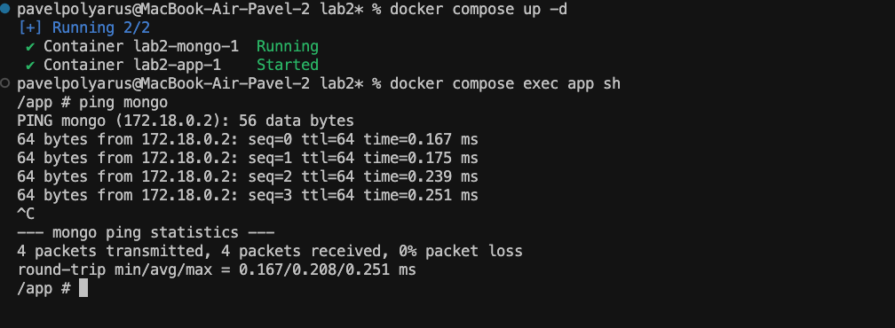

# **Лабораторная работа 2 со здвездочкой**
В данной работе используется Docker Compose для развертывания двух контейнеров: один с Python-приложением, использующим библиотеку pymongo для вывода информации из имеющихся БД, второй — с MongoDB. 

Цель задания — выявить и исправить три "плохие практики" при написании Docker Compose файлов, а также настроить изоляцию между контейнерами, чтобы они не могли взаимодействовать друг с другом по сети.

## **Пример плохого docker-compose**

```yaml
services:
  app:
    build: ./app

  mongo:
    image: mongo:latest
```
## **Пoяснение**
1. Использование `latest` версий может привести к проблемам в будущем, если выйдет несовместимое обновление MongoDB. Оптимальным решением будет указание конкретной версии образа MongoDB.

2. Рекомендуется использовать директиву `depends_on`, которая гарантирует, что контейнер с MongoDB запустится раньше, чем контейнер с приложением, что предотвратит возникновение ошибок при подключении.

3. По-хорошему, нужно использовать директивы `deploy.resources.limits`, чтобы задать конкретные ограничения на использование ресурсов для каждого контейнера. 

## **Исправленный docker-compose**

```yaml
services:
  app:
    build: ./app
    depends_on:
      - mongo
    deploy:
      resources:
        limits:
          cpus: '0.50'
          memory: 512M
  mongo:
    image: mongo:4.4
    deploy:
      resources:
        limits:
          cpus: '0.50'
          memory: 512M
```

## **Вывод программы**
1. Применим все измененя через `docker compose build`
2. Запустим все контейнеры с помощью `docker compose up`


Видим, что на консоль вывелась вся информация о наших БД. 

Лог `app-1` показывает, что в базе данных есть три базы: `admin`, `config` и `local`

Каждая из баз данных также имеет информацию о размере на диске. 

В общем все успешно работает, как и с плохим файлом, так и с хорошим.


## **Изоляция контейнеров**
Перед тем как изолировать контейнеры, убеимся, что контейнер `mongo` пингуется из котейнера `app`:
1. Запустим оба контейнера в фоновом режиме с помощью команды `docker compose up -d`
2. Подключимся к оболочке sh первого контейнера введя комнаду `docker compose exec app sh`
3. Попробуем пинговать контейнер с MongoDB, с помощью `ping momgo`



Все получилось, значит контейнеры видят друг друга.

Для изоляции контейнеров необходимо создать две отдельные сети для каждого контейнера: это предотвращает прямое взаимодействие между ними, так как при запуске контейнеров через docker-compose, контейнеры по умолчанию помещаются в одну сеть.
В директиве `networks` для каждого контейнера пропишем `app-net` и `mongo-net` соотетсвенно.
```yaml
services:
  app:
    build: ./app
    depends_on:
      - mongo
    networks:
      - app-net
    deploy:
      resources:
        limits:
          cpus: '0.50'
          memory: 512M
  mongo:
    image: mongo:4.4
    networks:
      - mongo-net
    deploy:
      resources:
        limits:
          cpus: '0.50'
          memory: 512M
networks:
  app-net:
    driver: bridge
  mongo-net:
    driver: bridge
```
Для того, чтоб убедиться, что контейнеры изолированы друг от друга, попробуем пинговать контейнер `mongo` из котейнера `app`:
1. Применим все изменения к контейнерам через `docker compose build`
2. Запустим оба контейнера в фоновом режиме с помощью команды `docker compose up -d`
3. Подключимся к оболочке sh первого контейнера введя комнаду `docker compose exec app sh`
4. Попробуем пинговать контейнер с MongoDB, с помощью `ping momgo`


Видим, что оба контейнера были успешно запущены, но контейнер `app` не видит `mongo`.
Помимо этого, перестало работать само приложение, так как теперь оно никак не может взаимодействовать с БД.

## **Итоги**
1. Написали плохой docker compose, все недочеты и их решения были описаны.
2. Исправили все недочеты, убедились что все процессы успешно запускаются.
3. Настроили сетевую изоляциюмежду двумя контейнерами, поверили что контейнер А действительно не видит контейнер Б.
