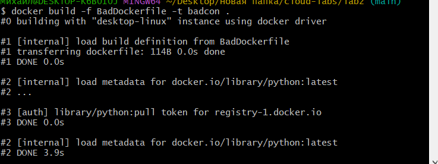
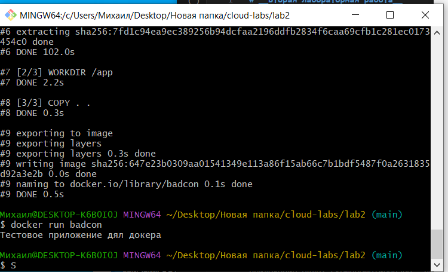
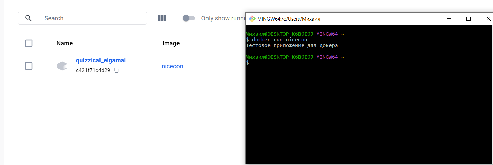

# __Вторая лабораторная работа__
## __Плохой DockerFile__
```
FROM python:latest

WORKDIR /app

COPY . .

CMD ["python", "app.py"]
```

Создаем образ и запускаем контейнер 




На первый взгляд - все ок, но есть паруу проблем.

__Проблема № 1__

Использование latest: такая практика плоха, так как может вызвать проблемы с совместимостью в будущем, поскольку этот тег всегда указывает на последнюю версию Python, что в свою очередь может привести к непредсказуемому поведению при обновлении образа.

__Прблема 2__
Приложение запускается от имени пользователя по умолчанию, который в данном случае является пользователем root. Это может быть потенциальной уязвимостью. Запуск приложения от имени root может привести к серьезным проблемам с безопасностью. Если приложение будет скомпрометировано, злоумышленник получит доступ с правами root.

__Проблема 3__
Команда COPY . /app , которая копирует всё содержимое текущей директории в контейнер, включая потенциально ненужные файлы (например, .git)

## __Хороший DockerFile__
```
FROM python:3.9-slim

WORKDIR /app

COPY app.py .

RUN useradd -m myuser
USER myuser

CMD ["python", "app.py"]
```
Запускаем его:
назовем образ nicecon

__Решение Проблемы № 1__

Теперь у нас не возникнут проблемы с совместимостью или безопасностью - прошлая сборка гарантированно будет работать, как и новая, так как мы вручную указываем `python:3.9-slim`.

__Решение Проблемы № 2__
Создание нового пользователя myuser и установка его как пользователя по умолчанию для выполнения команд в контейнере. Это увеличивает безопасность, так как приложение не будет выполняться от имени root.

__Решение Проблемы № 3__
Использовать .dockerignore, чтобы исключить ненужные файлы и директории, или , как сделал я - явно указывать нужные файлы в COPY.

## __Проблемы с контейнерами__

1. Запуск контейнеров с неограниченным доступом к ресурсам
Неограниченное использование ресурсов может привести к тому, что один контейнер заблокирует важные системные ресурсы (например, всю доступную память или CPU), что негативно повлияет на другие приложения или контейнеры.

В таких ситуациях можно ограничивать ресурсы контейнеров через параметры --memory и --cpu при запуске контейнера.

2. Отсутсвие контроля за контейнерами

Если контейнеры продолжают работать, хотя они уже не нужны, это может привести к серьёзным последствиям. Например, может произойти перегрузка системы, особенно если контейнеров много. Также банальное "замусоривание системы" - разные ненужные временные файлы, которые копятся на дисковом пространстве. Нужно использовать `docker stop`, `docker rm` чтобы остановливать и удалять контейнеры.